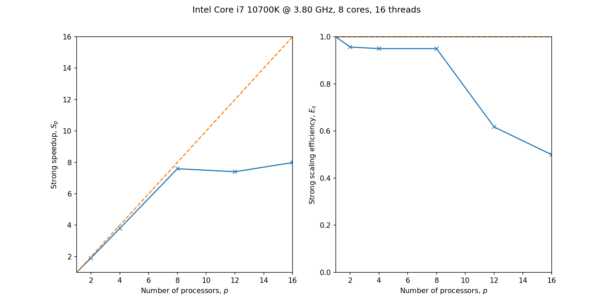
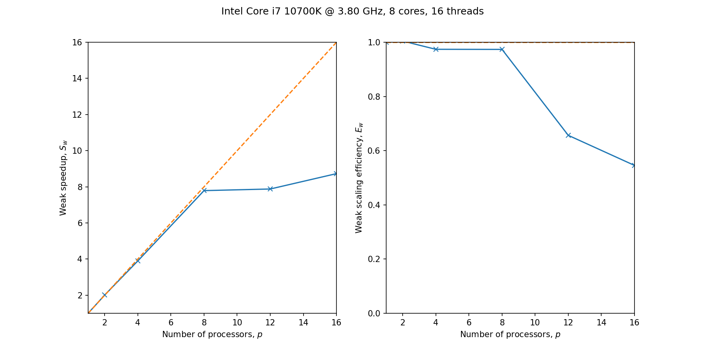

# High performance parallel algorithms

Shared and distributed memory parallel algorithms in C. Custom implementations
of functions using OpenMP and MPI, as well as demonstrations of library calls.

## Status
[](https://github.com/apallath/parallel_algos/issues)
[](https://github.com/apallath/parallel_algos/issues)

## Requirements
- Intel oneAPI (for Intel compilers, Intel MKL, and Intel MPI.)
OR
- An MPI implementation.
- BLAS, PBLAS, LAPACK and ScaLAPACK implementations.

## Building from source
Customize environment variables in `build.sh`. At present, this script is
designed for Intel oneAPI (Intel compilers/MPI/MKL).

Generate makefiles and build using CMake by running the script:

```sh
./build.sh
```

## Contents

### Simple OpenMP and MPI demonstration programs (`demo_usage`)
- Demonstrations of point-to-point and collective MPI operations (`demo_usage/mpi_*.c`)
- Parallel pi computation (via integration) in OpenMP and MPI (`demo_usage/{}_pi.c`)

### Dense Linear Algebra function implementations (`dense_algebra`)
Using libraries:
- Matrix multiplication using BLAS (`dense_algebra/mm_blas.c`)
- Distributed memory parallel matrix multiplication using PBLAS (`dense_algebra/mm_pblas.c`)
- LU factorization using LAPACK (`dense_algebra/lu_lapack.c`)
- LU factorization using ScaLAPACK (`dense_algebra/lu_scalapack.c`)

Custom implementations:
- Matrix multiplication using OpenMP
- Matrix multiplication using MPI (SUMMA)

## To run strong scaling and weak scaling benchmarks
- Run
```sh
./run_all_benchmarks.sh
```
in the build directory.

A python script to analyze benchmark outputs is in the `sample_benchmarks/` directory.

Sample plots generated by the script:




